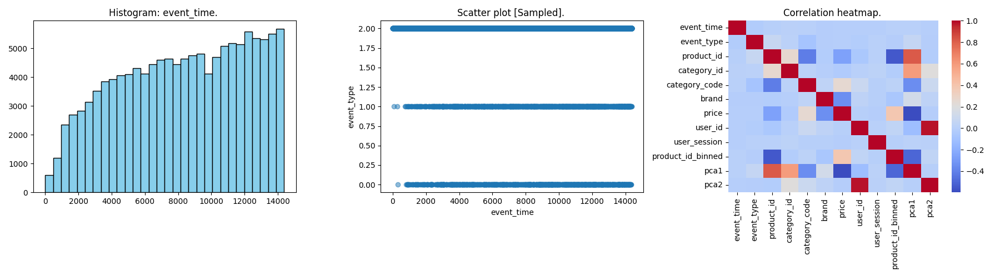

# 🚀 Automated Big Data Pipeline: E-Commerce Behavior Analysis

## 📝 Project Description
This project implements a fully automated, containerized end-to-end data pipeline using **Docker**. The pipeline processes a massive eCommerce dataset through five distinct stages: Ingestion, Preprocessing, Statistical Analytics, Visualization, and Machine Learning (Clustering). All outputs are automatically extracted from the container to the local host directory via a shell script.

## 📊 Dataset
* **File:** `2019-Oct.csv`
* **Note:** To handle the 5GB file size on standard hardware, the pipeline utilizes **memory-safe sampling** (processing the first 200,000 rows) to ensure execution without "Killed" errors.

## 👥 Team Members & Contributions
| Member Name | ID | Primary Responsibility |
| :--- | :--- | :--- |
| **Yousef Mahmoud Ali** (Leader) | 231001086 | Data Analysis & Preprocessing (Tasks 3 & 4) |
| **Yehia Ashraf Aly** | 231001297 | Data Ingestion & Dockerfile (Tasks 1 & 2) |
| **Mostafa Abd Elhamied** | 231000842 | Visualization & K-Means Clustering (Tasks 5 & 6) |
| **Youssef Hassan Nasr** | 231000751 | Automation (summary.sh) & Documentation (Tasks 7 & 8) |

---

## ⚙️ Execution Instructions

### 1. Build the Docker Image
Open your terminal in the project root folder and run:
```bash
docker build -t data-pipeline .

docker run -it data-pipeline

# In the interactive docker:
python ingest.py 2019-Oct.csv

# To view the results in your local desktop run in git bash:
./summary.sh
```

# Execution Flow:
1. **`ingest.py`**: Loads the raw 5GB eCommerce dataset (sampled for memory safety) and saves a local copy as `data_raw.csv`.
2. **`preprocess.py`**: Handles missing values, encodes categorical columns (like brands), scales numerical features, discretizes price data, applies PCA for dimensionality reduction, and saves `data_preprocessed.csv`.
3. **`analytics.py`**: Extracts metadata and computes a statistical summary, outputting the results into `insight1.txt`, `insight2.txt`, and `insight3.txt`.
4. **`visualize.py`**: Generates a composite figure containing a distribution histogram, a sampled scatter plot, and a correlation heatmap, saved as `summary_plot.png`.
5. **`cluster.py`**: Performs K-Means clustering (k=3) on the numerical subset of data to segment customers, outputting the cluster populations to `clusters.txt`.

# Sample outputs:
` Kmeans clustering result with k = 3: `
* **Cluster 0:** 32940 samples
* **Cluster 1:** 33806 samples
* **Cluster 2:** 33254 samples

# Visualization:


